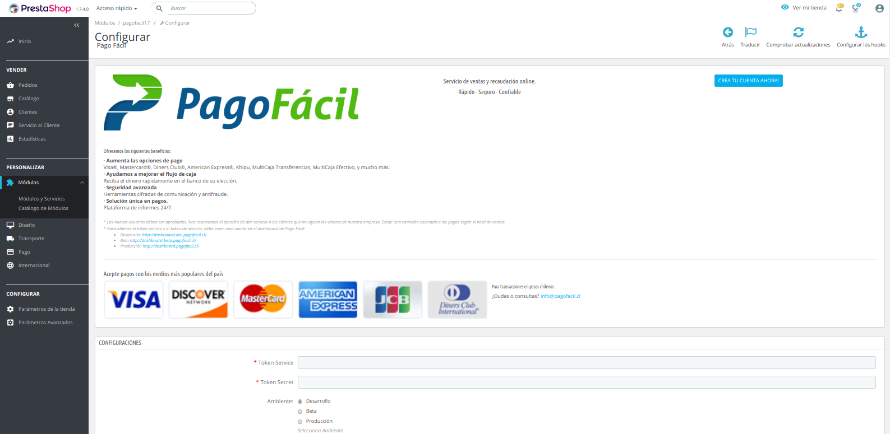

# Pago Fácil SpA

## Use
### Requirements

- Prestashop v1.7
- Have an associated account in [Pago Fácil](https://dashboard.pagofacil.cl/)

### Installation

There are 2 ways to install the plugin:

1) Download the plugin from https://github.com/PSTPAGOFACIL/PagoFacil17, uncompress the file and rename the directory to "pagofacil17", then compres the folder (zip) with "pagofacil17" as name.  Upload file .zip  using Prestashop's Backoffice.
2) Leave the decompressed plugin in the "modules/pagofacil17" folder inside the Prestashop installation folder.

Once this is done, go to the "Modules" section and look for Pago Fácil, then click on the "Install" button

### Configuration

When the plugin is installed, click on the "Configure" button that appears on the right side of the plugin. The following view will be displayed:

- You must select the environment in which you want to work, placing if you want to work in a development environment.
- Add the "Token Service" and "Token Secret" that provides Pago Fácil
- Click on the save button

Once these steps are completed, you can use the payment method with Pago Fácil.
